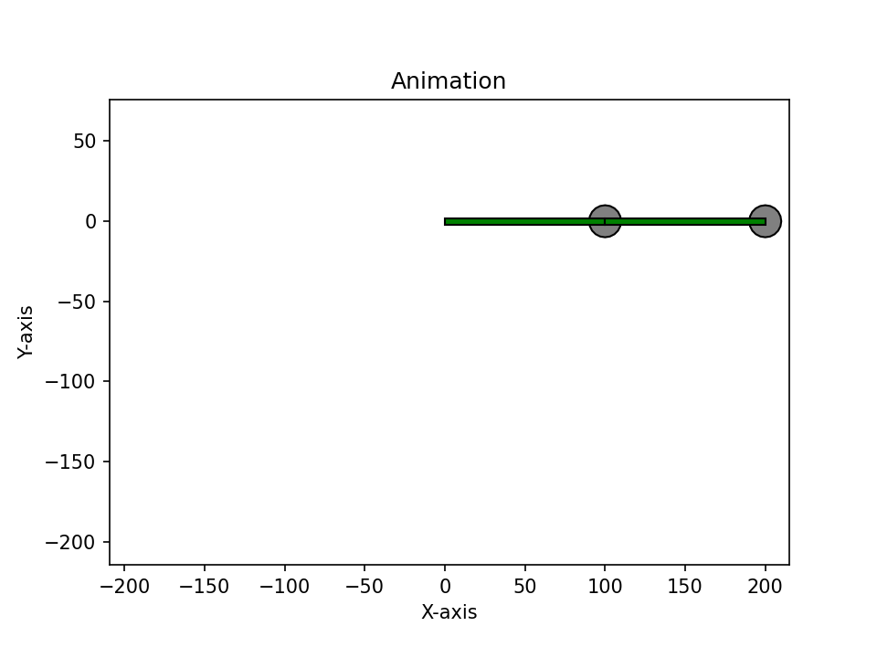

# Double Pendulum Simulation

This example simulates the chaotic motion of a double pendulum system. The system consists of two masses attached by rigid, massless rods, where the second pendulum is attached to the end of the first.

## Mathematical Model

The Equations of Motion (EOM) are derived using the **Euler-Lagrange method**, which analyzes the energy of the system rather than the forces.

### System Definitions

We define the system using the generalized coordinates $\theta_1$ and $\theta_2$ (angles relative to the vertical axis).

- **Lengths**: $L_1, L_2$
- **Masses**: $m_1, m_2$
- **Coordinates**: $(x_1, y_1)$ and $(x_2, y_2)$

### 1. Kinematics

First, we express the Cartesian positions in terms of the angles:

$$
\begin{aligned}
x_1 &= L_1 \sin \theta_1 \\
y_1 &= -L_1 \cos \theta_1 \\
x_2 &= x_1 + L_2 \sin \theta_2 \\
y_2 &= y_1 - L_2 \cos \theta_2
\end{aligned}
$$

Differentiating with respect to time yields the velocities:

$$
\begin{aligned}
\dot{x}_1 &= L_1 \dot{\theta}_1 \cos \theta_1 \\
\dot{y}_1 &= L_1 \dot{\theta}_1 \sin \theta_1 \\
\dot{x}_2 &= \dot{x}_1 + L_2 \dot{\theta}_2 \cos \theta_2 \\
\dot{y}_2 &= \dot{y}_1 + L_2 \dot{\theta}_2 \sin \theta_2
\end{aligned}
$$

### 2. Kinetic Energy ($T$)

The total kinetic energy is the sum of the energies of the individual masses:

$$
T = \frac{1}{2}m_1 (\dot{x}_1^2 + \dot{y}_1^2) + \frac{1}{2}m_2 (\dot{x}_2^2 + \dot{y}_2^2)
$$

Substituting the velocity expressions and simplifying using trigonometric identities ($\sin^2 + \cos^2 = 1$) gives:

$$
T = \frac{1}{2}(m_1 + m_2) L_1^2 \dot{\theta}_1^2 + \frac{1}{2}m_2 L_2^2 \dot{\theta}_2^2 + m_2 L_1 L_2 \dot{\theta}_1 \dot{\theta}_2 \cos(\theta_1 - \theta_2)
$$

### 3. Potential Energy ($V$)

Assuming the $y$-axis points upwards (so positions below the pivot are negative):

$$
V = m_1 g y_1 + m_2 g y_2
$$

Substituting the position equations:

$$
V = -(m_1 + m_2) g L_1 \cos \theta_1 - m_2 g L_2 \cos \theta_2
$$

### 4. The Lagrangian

The Lagrangian $\mathcal{L}$ is defined as the difference between kinetic and potential energy:

$$
\mathcal{L} = T - V
$$

$$
\mathcal{L} = \frac{1}{2}(m_1 + m_2) L_1^2 \dot{\theta}_1^2 + \frac{1}{2}m_2 L_2^2 \dot{\theta}_2^2 + m_2 L_1 L_2 \dot{\theta}_1 \dot{\theta}_2 \cos(\theta_1 - \theta_2) + (m_1 + m_2) g L_1 \cos \theta_1 + m_2 g L_2 \cos \theta_2
$$

### 5. Euler-Lagrange Equations

To find the equations of motion, we apply the Euler-Lagrange equation for each coordinate $\theta_i$:

$$
\frac{d}{dt} \left( \frac{\partial \mathcal{L}}{\partial \dot{\theta}_i} \right) - \frac{\partial \mathcal{L}}{\partial \theta_i} = 0
$$

Solving this system of derivatives results in two coupled second-order differential equations.

**For $\theta_1$:**

$$
(m_1 + m_2) L_1 \ddot{\theta}_1 + m_2 L_2 \ddot{\theta}_2 \cos(\theta_1 - \theta_2) + m_2 L_2 \dot{\theta}_2^2 \sin(\theta_1 - \theta_2) + (m_1 + m_2) g \sin \theta_1 = 0
$$

**For $\theta_2$:**

$$
L_2 \ddot{\theta}_2 + L_1 \ddot{\theta}_1 \cos(\theta_1 - \theta_2) - L_1 \dot{\theta}_1^2 \sin(\theta_1 - \theta_2) + g \sin \theta_2 = 0
$$

### Final Equations of Motion

Solving the system above for the angular accelerations $\ddot{\theta}_1$ and $\ddot{\theta}_2$ yields the explicit forms required for numerical integration:

$$
\ddot{\theta}_1 = \frac{-g(2m_1 + m_2)\sin\theta_1 - m_2 g \sin(\theta_1 - 2\theta_2) - 2\sin(\theta_1 - \theta_2) m_2 (\dot{\theta}_2^2 L_2 + \dot{\theta}_1^2 L_1 \cos(\theta_1 - \theta_2))}{L_1 (2m_1 + m_2 - m_2 \cos(2\theta_1 - 2\theta_2))}
$$

$$
\ddot{\theta}_2 = \frac{2\sin(\theta_1 - \theta_2) (\dot{\theta}_1^2 L_1 (m_1 + m_2) + g(m_1 + m_2)\cos\theta_1 + \dot{\theta}_2^2 L_2 m_2 \cos(\theta_1 - \theta_2))}{L_2 (2m_1 + m_2 - m_2 \cos(2\theta_1 - 2\theta_2))}
$$

## Implementation Details

### State Vector

To solve these second-order ODEs numerically, we convert them into a system of four first-order ODEs. The state vector is:

$$
\mathbf{S} = [\theta_1, \theta_2, \omega_1, \omega_2]
$$

Where $\omega = \dot{\theta}$ represents angular velocity. The derivative of the state vector is $[\omega_1, \omega_2, \ddot{\theta}_1, \ddot{\theta}_2]$.

## Example Preview



## Usage

You can run this example directly:

```bash
python examples/double-pendulum/double-pendulum.py
```

Or via the main entry point:

```python
from examples import double_pendulum_main

def main():
    double_pendulum_main()
```

*Note: The output is saved as `double-pendulum.gif` in the script's directory.*
