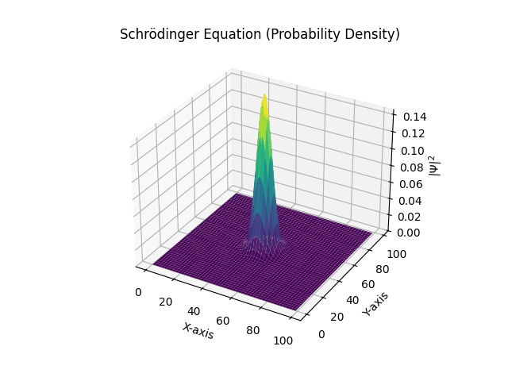

# Schrödinger Equation Simulation

This example simulates the time evolution of a quantum wave packet in a 2D potential well using the Time-Dependent Schrödinger Equation (TDSE).

## Mathematical Model

The system is governed by the Time-Dependent Schrödinger Equation:

$$
i \hbar \frac{\partial \Psi}{\partial t} = \hat{H} \Psi
$$

Where:

- $\Psi(\vec{r}, t)$ is the complex wave function.
- $\hbar$ is the reduced Planck constant (set to 1 for simulation units).
- $\hat{H}$ is the Hamiltonian operator: $\hat{H} = -\frac{\hbar^2}{2m} \nabla^2 + V(\vec{r})$.

### Discretization

We solve the equation on a 2D grid. The Laplacian $\nabla^2 \Psi$ is approximated using the finite difference method:

$$
\nabla^2 \Psi(x, y) \approx \frac{\Psi(x+h, y) + \Psi(x-h, y) + \Psi(x, y+h) + \Psi(x, y-h) - 4\Psi(x, y)}{h^2}
$$

This transforms the partial differential equation into a system of coupled Ordinary Differential Equations (ODEs) for the value of $\Psi$ at each grid point.

## Implementation Details

### State Vector

Since $\Psi$ is complex, we split it into real and imaginary parts for the numerical solver:

$$
\mathbf{S} = [\text{Re}(\Psi_{0,0}), \dots, \text{Re}(\Psi_{N,N}), \text{Im}(\Psi_{0,0}), \dots, \text{Im}(\Psi_{N,N})]
$$

The solver computes the time derivatives:

$$
\frac{d \text{Re}(\Psi)}{dt} = \text{Im}(\hat{H} \Psi) / \hbar
$$

$$
\frac{d \text{Im}(\Psi)}{dt} = -\text{Re}(\hat{H} \Psi) / \hbar
$$

### Simulation Setup

- **Potential ($V$)**: A 2D box with high walls at the boundaries to confine the particle.
- **Initial State**: A Gaussian wave packet with initial momentum, representing a particle moving through the box.

## Example Preview



## Usage

You can run this example directly:

```bash
python examples/schrodinger-equation/schrodinger-equation.py
```

_Note: The output is saved as `schrodinger-equation.gif` in the script's directory._
