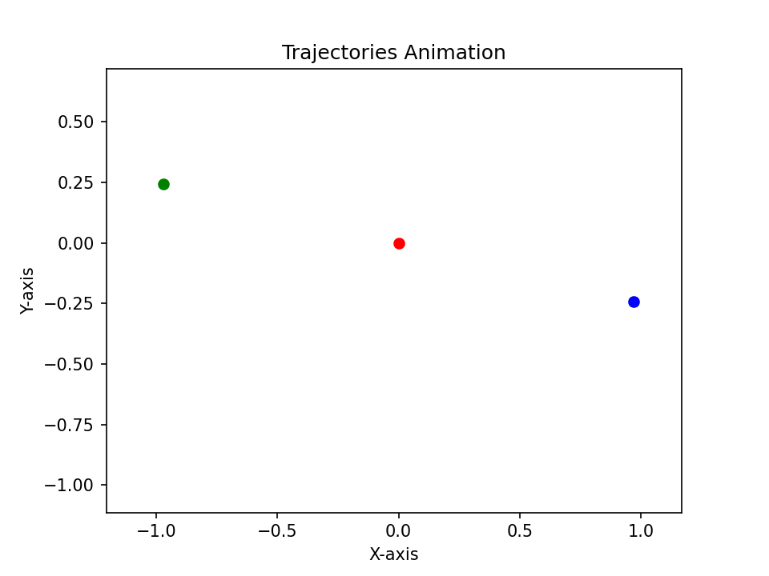

# Three-Body Problem Simulation

This example simulates the gravitational interaction between three bodies in 2D space.

## Mathematical Model

The simulation generalizes Newton's Law of Universal Gravitation for $N$ bodies.

### Gravitational Force

The total force $\vec{F}_i$ exerted on body $i$ is the vector sum of the gravitational forces from all other bodies $j$:

$$
\vec{F}_i = \sum_{j \neq i} \vec{F}_{ij} = \sum_{j \neq i} G \frac{m_i m_j}{|\vec{r}_{ij}|^2 + \epsilon^2} \hat{r}_{ij}
$$

Where:

- $\vec{r}_{ij} = \vec{r}_j - \vec{r}_i$ is the vector from body $i$ to body $j$.
- $\epsilon$ is a "softening" parameter (set to $10^{-5}$) to prevent numerical instability if bodies collide (division by zero).
- $G$ is the gravitational constant.

### Equations of Motion

For each body, the acceleration is:

$$
\vec{a}_i = \frac{d^2\vec{r}_i}{dt^2} = \sum_{j \neq i} G \frac{m_j}{|\vec{r}_{ij}|^3} \vec{r}_{ij}
$$

## Implementation Details

### State Vector

The system state is a flattened vector of size $4 \times N$ (where $N=3$), containing position and velocity components for each planet:

$$
\mathbf{S} = [x_1, y_1, v_{x1}, v_{y1}, \dots, x_3, y_3, v_{x3}, v_{y3}]
$$

### Parameters

The simulation uses the following initial conditions.

- **Masses**: All three bodies have equal mass ($m = 100 \times 10^8$).
- **Initial Positions & Velocities**:
  - **Planet 1**: $(0.97, -0.24)$, Velocity: $(-0.23, -0.21)$
  - **Planet 2**: $(-0.97, 0.24)$, Velocity: $(-0.23, -0.21)$
  - **Planet 3**: $(0, 0)$, Velocity: $(0.46, 0.43)$

## Example Preview



## Usage

You can run this example directly:

```bash
python examples/three-body-problem/three-planets.py
```

Or via the main entry point:

```python
from examples import three_body_problem_main

def main():
    three_body_problem_main()
```

_Note: The output is saved as `three-planets.gif` in the script's directory._
